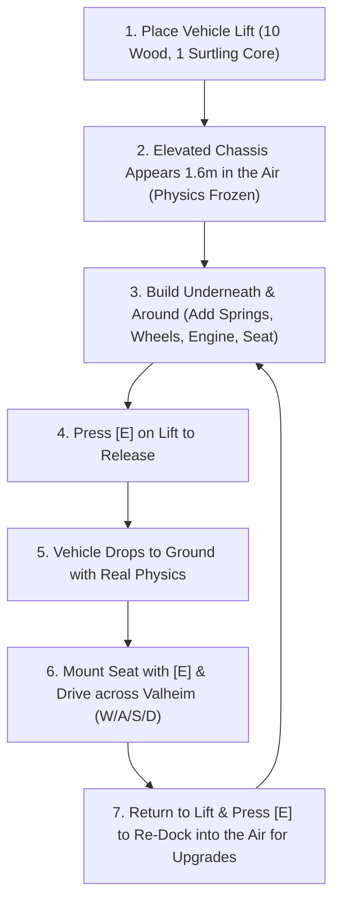

# Valhicle - Product Vision & Gameplay Specification

This document defines the **core gameplay vision, player experience, and feature requirements** for the **Valhicle** mod. It serves as the single source of truth for what this mod is designed to do and how it should feel to play.

---

## 1. The Core Vision

> **"Scrap Mechanic and Trailmakers meet Viking survival."**

In vanilla Valheim, moving cargo across land relies on pulling a fragile hand cart that frequently gets stuck, rolls backward, or flips on rough terrain.

**Valhicle** transforms Valheim's sandbox by allowing players to engineer **custom, motorized, physics-driven land vehicles**:
* Built piece-by-piece from modular parts.
* Tailored for rough biomes (Meadows, Black Forest, Plains, Mistlands).
* Powered by steam engines that burn Coal to climb steep hills with heavy ore cargo.
* Created through an intuitive engineering loop inspired by modular sandbox vehicle games.

---

## 2. The Ideal Gameplay Loop

### Phase 1: Workshop & Elevation (The Lift)
* The player places a **Vehicle Building Lift** (costing 10 Wood and 1 Surtling Core) on any flat ground.
* Immediately, an elevated **Starter Chassis Platform** appears **1.6 meters in the air**, completely locked in place with zero physics drift (`isKinematic = true`).
* This elevated stance is crucial: it gives the player plenty of clearance to walk underneath the vehicle to place suspensions, mechanical bearings, and wheels without fighting gravity or uneven terrain.

### Phase 2: Modular Engineering
* Using the **Mechanic's Wrench** or Hammer, the player snaps components together:
  1. **Suspension**: Places vertical shock struts with real 3D coiled metal springs at each wheel point.
  2. **Steering Bearings**: Places compact button swivel bearings to allow front wheels (or rear wheels) to turn.
  3. **Wheels**: Attaches authentic Viking cart wheels (Small, Medium, or Large). Toggles individual wheel spin direction with **[E]** if a reverse gear or crawler configuration is needed.
  4. **Power**: Installs a Steam Engine onto the chassis, loading it with Coal.
  5. **Controls**: Places a Driver Seat with an angled steering column and steering wheel.
  6. **Utility**: Expands the chassis with wooden walls, carts, chests, or banners to haul metal and raw resources.

### Phase 3: Launch & Testing (The Drop)
* The player walks up to the Lift and presses **[E]** (or clicks it with the Mechanic's Wrench).
* The lift disengages: the vehicle's physics activate, and the vehicle **drops cleanly to the ground**.
* The coiled springs compress on impact, the wheels establish ground traction, and the vehicle settles under its own weight.

### Phase 4: Driving & Exploration
* The player walks up to the driver seat and presses **[E]** to climb in.
* The Viking sits firmly in the chair, arms positioned forward on the controls.
* Controls:
  * **W / S**: Throttle / Reverse (feeds torque from the steam engine to all motorized wheels; coal burns and smoke puffs from the exhaust).
  * **A / D**: Steers front steering knuckle bearings and smoothly turns the interactive steering wheel.
  * **Space**: Handbrake.
  * **E**: Exit / dismount vehicle.

### Phase 5: Servicing & Re-docking
* When the player wants to repair, upgrade, or modify their cart:
* Drive back near the Lift and press **[E]** on the lift (or hit the cart with the Mechanic's Wrench).
* The cart instantly lifts back up into the air onto the 1.6m cradle, freezing physics so parts can be safely altered, swapped, or expanded.

---

## 3. Core Component Requirements

| Component | In-Game Asset Origin | Function & Player Experience |
| :--- | :--- | :--- |
| **Vehicle Lift** | Wood + Surtling Core | 1.6m elevated building stand; freezes physics for safe building; drops vehicle on release; re-docks on command. |
| **Mechanic's Wrench** | Wood + Stone | Handheld tool; opens dedicated Vehicle Workshop build menu; left-click to dock/release carts. |
| **Vehicle Chassis** | Wood + Nails | Structural wooden foundation (2m x 2m) with integrated `VehicleCore` physics coordinator. |
| **Cart Wheels (S/M/L)** | Valheim Cart wheel | Pure Viking wheel mesh; independent spinning hub; spherical ground traction; [E] toggles forward/reverse spin. |
| **Suspension Struts** | Dvergr Mechanical Spring | Functional shock absorber with dynamic 3D metal spring that visibly stretches and compresses over bumps. |
| **Swivel Bearings** | Mechanical Button Puck | Compact rotating button disc; cycles modes: Steering (knuckle), Free-Spinning (caster), Motorized (continuous). |
| **Driver Seat** | Viking Chair + Wheel | Interactive driving station; uses `IDoodadController` to steer with A/D, throttle with W/S, and keep player seated. |
| **Steam Engines** | Smelter boiler | Coal-burning power unit (Small & Heavy); consumes Coal during throttle, puffs smoke, and feeds drive torque. |

---

## 4. Design Tenets & Constraints

1. **Viking Flavor First**: All components must look and feel like they belong in the 10th Norse world. No modern rubber tires or plastic parts. Everything is crafted from Viking wood, bronze, iron, and Dvergr engineering.
2. **Zero Unity Editor Dependency**: Everything is procedurally created and wired at runtime from base game assets. Players only need to drop the DLL into `BepInEx/plugins`.
3. **No Unwanted Destruction**: Vehicle parts must receive structural stability from the chassis and never collapse due to Valheim's standard `WearNTear` roof/ground rules.
4. **Seamless Physics & Stability**: Vehicles must have a lowered center of mass to prevent unwanted tipping, with responsive suspension damping to handle rocky terrain.
